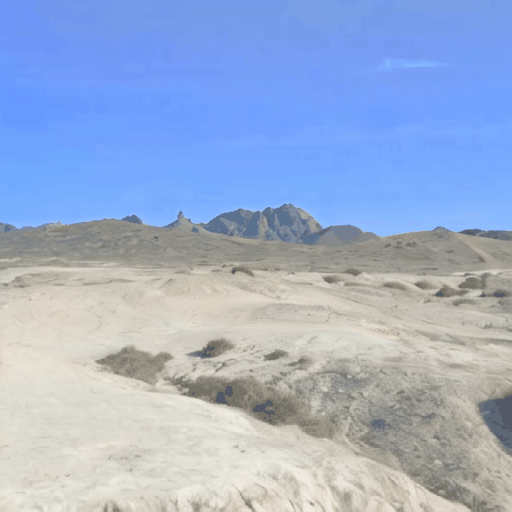
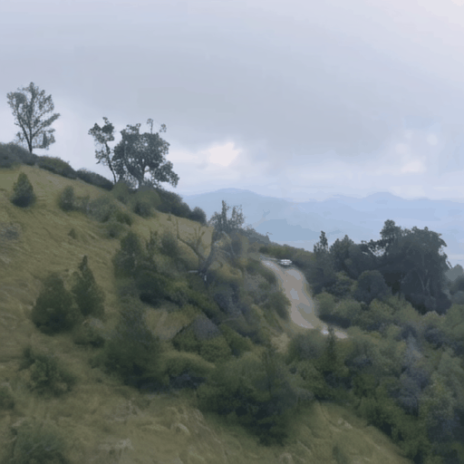

# Motion LoRA: Learn motion using Low-Rank Adaptation
<div align="center">

</div>


<table>
  <tr>
    <th style="text-align:center;">Input Image</th>
    <th style="text-align:center;">Naive SVD</th>
    <th style="text-align:center;">Forward LoRA</th>
  </tr>
  <tr>
    <td style="text-align:center;">
      
    </td>
    <td style="text-align:center;">
      
    </td>
    <td style="text-align:center;">
      
    </td>
  </tr>
  <tr>
    <td style="text-align:center;">
      
    </td>
    <td style="text-align:center;">
      
    </td>
    <td style="text-align:center;">
      
    </td>
  </tr>
</table>


Forward Camera movement LoRA, trained with 512 X 512 resolution

<table>
  <tr>
    <th style="text-align:center;">Input Image</th>
    <th style="text-align:center;">Naive SVD</th>
    <th style="text-align:center;">Backward LoRA</th>
  </tr>
  <tr>
    <td style="text-align:center;"></td>
    <td style="text-align:center;"></td>
    <td style="text-align:center;"></td>
  </tr>
  <tr>
    <td style="text-align:center;"></td>
    <td style="text-align:center;"></td>
    <td style="text-align:center;"></td>
  </tr>
</table>
Backward Camera movement LoRA, trained on 512 X 512 resolution


## Main features

- Simple codebase for finetuning StableVideoDiffusion
- Motion LoRA training codebase for StableVideoDiffusion
  - You can train a LoRA for motion control!
- Compatible with ```diffusers```

## News 📰
**[2024.05.28]** The training code for Motion LoRA based on Stable Video Diffusion is uploaded!

You can also perfom Stable Video Diffusion fine tuning when you turn off the argument --train_lora 

## Clone our repository
```
git clone https://github.com/tykim0507/Motion-LoRA.git
cd MotionLoRA
```

## ☀️ Start with <a href="https://github.com/Stability-AI/generative-models">StableVideoDiffusion</a>

### 1. Environment Setup ⚙️ (python==3.10.14 recommended)
```
conda create -n motionlora python=3.10
conda activate motionlora
pip install -r requirements.txt
```

### 2.1 Download the models from Hugging Face🤗
|Model|Resolution|Checkpoint
|:----|:---------|:---------
|Stable-Video-Diffusion (Text2Video)|1024x576|[Hugging Face](https://huggingface.co/stabilityai/stable-video-diffusion-img2vid-xt-1-1)

I recommend git cloning the huggingface repository using git lfs
### 2.2 Set file structure
Store them as following structure:
```
cd MotionLoRA
    .
    └── models
        └── stable-video-diffusion-img2vid-xt-1-1

```

### 3. Prepare video datasets
I have used the <a href="https://mixkit.co/">Mixkit</a> dataset.  
You can simply prepare any type of videos, but with similar motion encoded.  
Actually using 1 video is enough for training the motion LoRA!


### 4. Run Training!
```
sh train.sh
```

## 😆 Citation
```
@article{motionloratykim,
	title = {MotionLoRA: Learn motion using Low-Rank Adaptation},
	author = {Taeyoon Kim},
	year = {2024},
}
```


## 🤓 Acknowledgements
Our codebase builds on [Stable Video Diffusion](https://github.com/Stability-AI/generative-models)
Thanks to the authors for sharing their codebases
